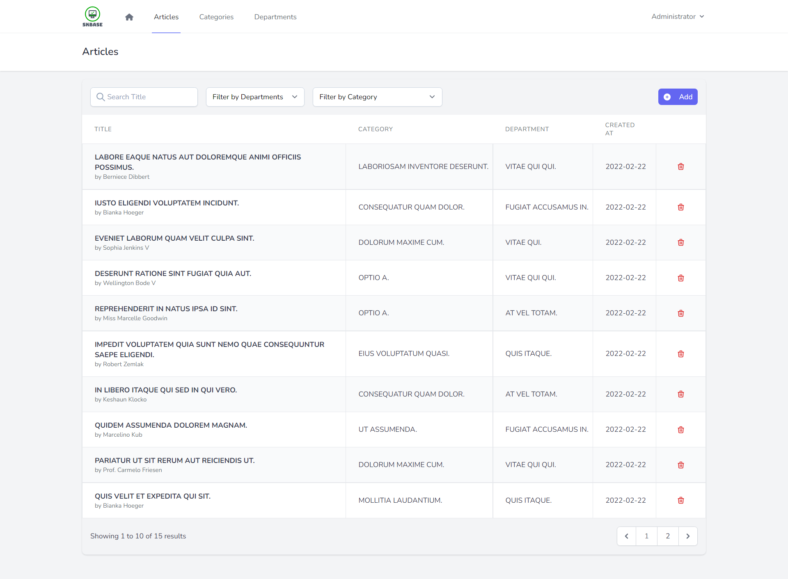
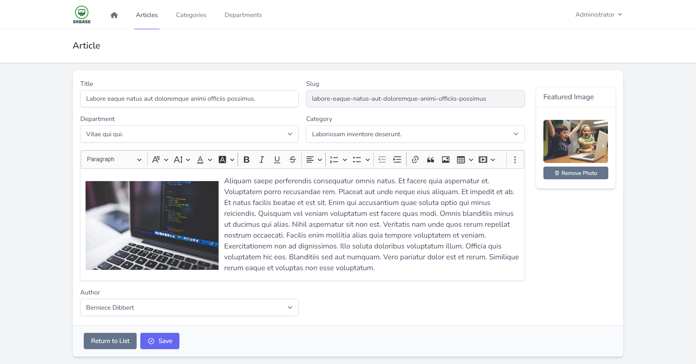

## About SKBase

Simple, but functional, Knowledge Base platform built with **Laravel 9 Framework**.

_Is a central place that allows structured storage of information where users can search for and access this information._

## Tools:

- [Laravel](https://laravel.com/).
- [Livewire](https://laravel-livewire.com/).
- [Tailwind](https://tailwindcss.com/).
- [WireUI](https://livewire-wireui.com/).

## Screenshots

## How to Install

1. Clone the repo : `git clone https://github.com/e-evaristo/SKBase.git`
2. `$ cd SKBase`
3. `$ composer install`
4. `$ cp .env.example .env`
5. `$ php artisan key:generate`
6. `$ php artisan storage:link`
7. Create new MySQL database for this application
8. Set database credentials on .env file
9. `$ php artisan migrate --seed`
10. `$ php artisan serve`
11. Visit: `http://127.0.0.1:8000/admin`
12. Login with :
    - email : `admin@admin.com`
    - password : `password`

## License

SKBase is open-sourced software licensed under the [MIT license](https://opensource.org/licenses/MIT).
